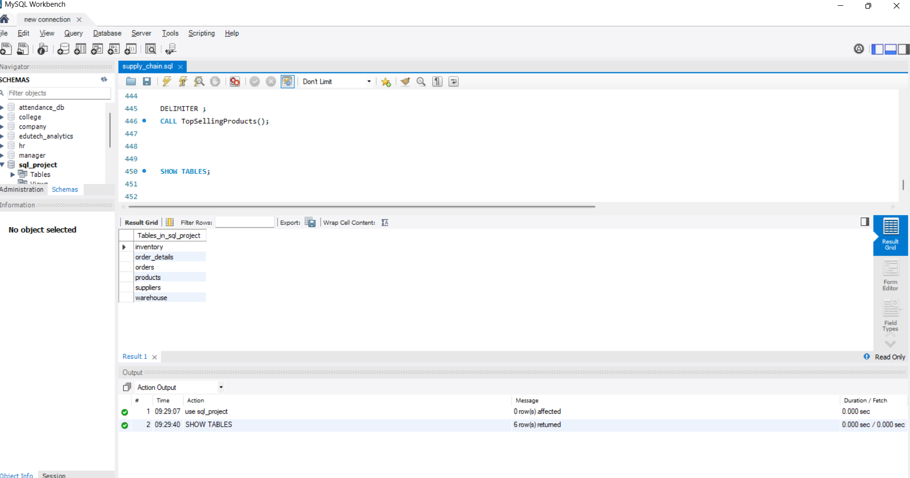
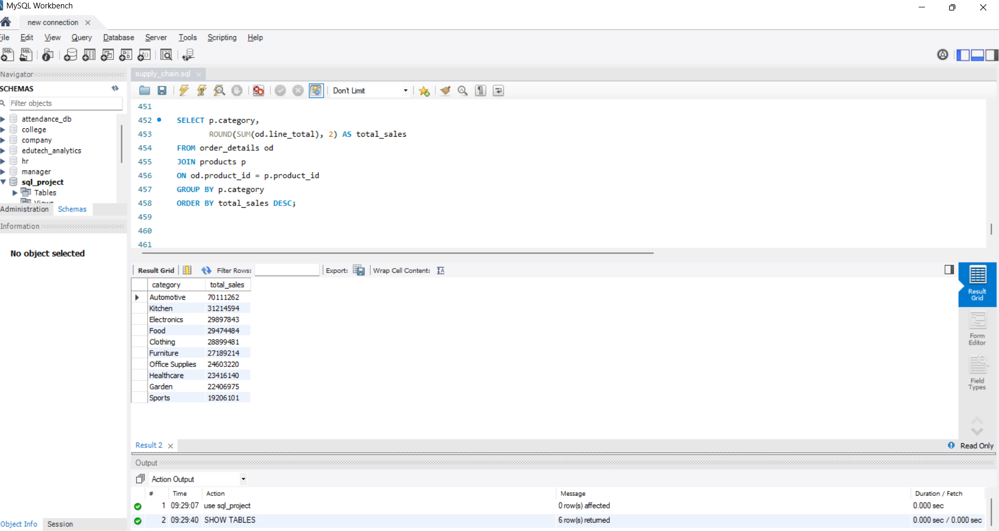
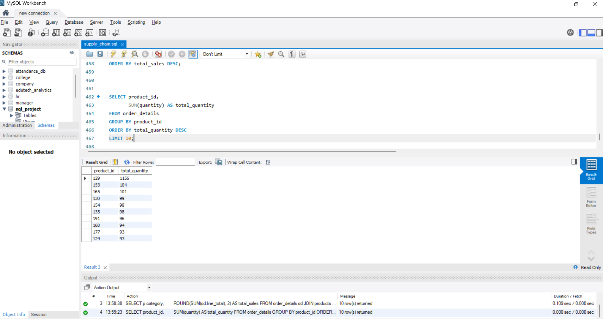
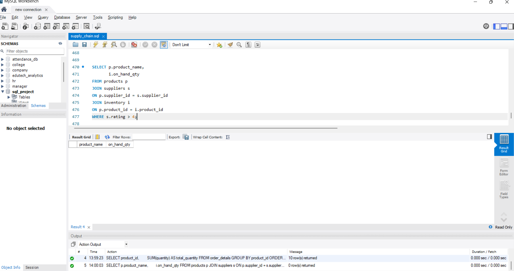
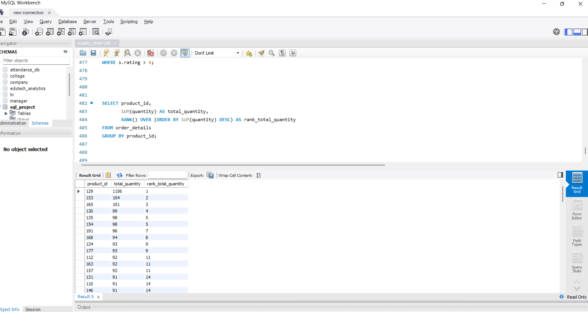

 Supply Chain Management Analytics – MySQL

 📌 Project Overview

This project is a MySQL-based Supply Chain Management Analytics solution designed to analyze products, suppliers, orders, order details, inventory, and warehouse operations.

The project uses a relational database to perform business analysis on sales, product demand, inventory, supplier performance, and order trends.

 🎯 Business Objectives

- Analyze product and category-wise sales performance
- Identify top-selling products
- Analyze product demand
- Monitor inventory quantities
- Evaluate supplier performance
- Analyze order status and trends
- Analyze product pricing
- Support supply chain decision-making

 🗂️ Database Tables

| Table | Purpose |
|---|---|
| products | Stores product details, categories, prices and supplier information |
| suppliers | Stores supplier information and ratings |
| orders | Stores customer orders, order dates and order status |
| order_details | Stores products, quantities, unit prices and order-level details |
| inventory | Stores on-hand quantities of products across warehouses |
| warehouse | Stores warehouse information |

 🛠️ SQL Concepts Used

- SELECT
- WHERE
- ORDER BY
- LIMIT
- UPDATE
- ALTER TABLE
- Aggregate Functions
- GROUP BY
- HAVING
- Logical Operators
- INNER JOIN
- Subqueries
- Window Functions
- Stored Procedures
- Indexing

 📊 Key Analysis

The project includes analysis of:

- Top 10 most expensive products
- Delivered orders placed in 2024
- Total sales by product category
- Inventory restocking
- Category-wise product price updates
- Cancelled orders requiring archival
- Top products based on order frequency
- Total quantity sold per product
- Total price per order
- Shipped and delivered orders
- Non-cancelled orders
- Product and supplier analysis using JOINs
- Products with suppliers having ratings above 4
- Products with above-average quantity sold
- Products with the highest quantity ordered
- Products that have not been ordered
- Product ranking based on total quantity sold
- Running quantity totals for products
- Product-wise order ranking

 🔍 Advanced SQL Analysis

The project demonstrates:

- Multi-table JOINs for combining product, supplier, order and inventory information
- Subqueries for comparing product quantities and identifying highest values
- Window functions including RANK() and ROW_NUMBER()
- Stored procedures for reusable inventory and product-sales analysis
- ALTER TABLE for database modification
- Indexing to improve query performance

 💡 Business Insights

The analysis helps identify high-performing products and categories, understand product demand, monitor inventory levels, evaluate supplier performance, and analyze order trends for supply chain decision-making.

 💻 Tools

- MySQL
- MySQL Workbench
- SQL

Vaishnavi Bhilare

Data Analytics | SQL | Mysql

  Project Screenshots

 1. Database Tables

 2. Sales by Category

 3. Top-Selling Products

 4. Supplier & Inventory Analysis

 5. Window Function Analysis

